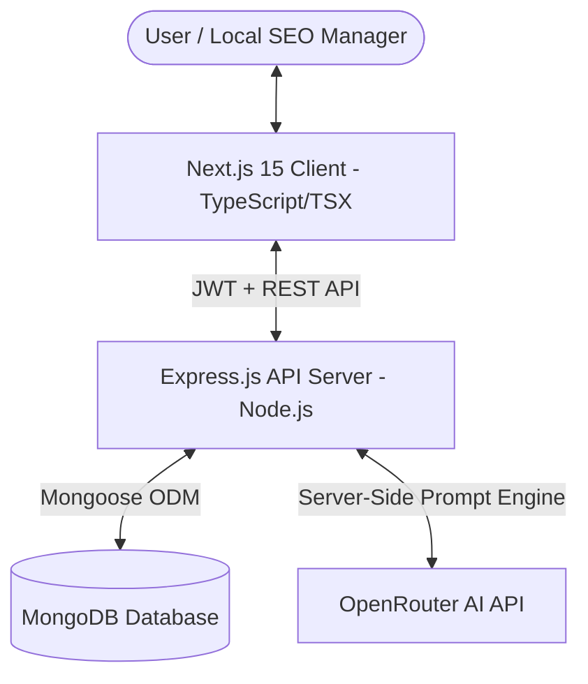

# 🚀 PostMakerGBP - AI-Powered Google Business Profile Post Manager

[](https://nextjs.org/)
[](https://nodejs.org/)
[](https://expressjs.com/)
[](https://www.mongodb.com/)
[](https://openrouter.ai/)
[](https://developer.mozilla.org/en-US/docs/Web/JavaScript)

An end-to-end full-stack web application designed for multi-location businesses, digital marketing agencies, and local SEO managers to generate, customize, preview, and manage high-ranking **Google Business Profile (GBP)** posts using **OpenRouter AI**.

---

## 📑 Table of Contents
- [Key Features](#-key-features)
- [System Architecture](#-system-architecture)
- [Technology Stack](#-technology-stack)
- [Required Flow Compliance](#-required-flow-compliance)
- [Getting Started & Local Setup](#-getting-started--local-setup)
- [Environment Variables](#-environment-variables)
- [How to Run Locally](#-how-to-run-locally)
- [API Documentation](#-api-documentation)
- [Deployment Guide](#-deployment-guide)

---

## ✨ Key Features

1. **AI Post Generation (OpenRouter AI)**:
   - Input business location, topic, post type, tone, language, and CTA.
   - Generates **3 distinct AI-powered post variations** per prompt:
     - *Variation 1*: Engaging & Community-Focused
     - *Variation 2*: Promotional & High-Conversion
     - *Variation 3*: Educational & Local Authority
   - Secure server-side OpenRouter API calls with resilient fallback templating.

2. **Live Google Business Profile Mockup**:
   - Pixel-perfect Google Search Knowledge Panel and Google Maps post preview.
   - Desktop and Mobile responsive preview toggles.
   - Live rendering of Business Avatar, verified badge, category, date, and interactive CTA buttons.

3. **Multi-Location Hub**:
   - Add and manage business branches and franchises (name, category, address, city, phone, website).
   - Pre-seeded mock locations (Dental Clinic, Coffee Shop, Fitness Center) for instant assessment grading.
   - Click any location card to immediately launch the AI Post Studio pre-loaded for that location.

4. **Draft & Instant Publish Engine**:
   - Save posts as **Draft** or mark as **Published**.
   - One-click publish action directly from dashboard cards and post management lists.
   - Real-time dashboard analytics (Total Locations, Total Posts, Drafts, Published).

5. **All Posts Management Hub**:
   - Full-text search across topics and post content.
   - Filter tabs: *All Posts*, *Drafts*, *Published*, and *Filter by Location*.
   - In-place editing modal, deletion confirmation, and clipboard text copier.

6. **1-Click Demo Evaluation Login**:
   - Instant 1-click test button on the login screen for rapid assessment review.

---

## 🏗️ System Architecture



---

## 🛠️ Technology Stack

| Layer | Technologies |
|---|---|
| **Frontend** | Next.js 15 (App Router), React 19, JavaScript (`.jsx` / `.js`), Tailwind CSS, Lucide React Icons |
| **Backend** | Node.js (v20+), Express.js (ES Modules), Mongoose, JWT, Bcrypt.js, Axios, Morgan |
| **Database** | MongoDB (Local or MongoDB Atlas) |
| **AI Model** | OpenRouter API (`meta-llama/llama-3.3-70b-instruct:free` or configurable via `.env`) |

---

## 📋 Required Flow Compliance

The application strictly implements the workflow defined in the Technical Assessment:

```
Login / Register ➔ Dashboard ➔ Locations ➔ Create GBP Post ➔ AI Generate (3 Variations) ➔ Select & Edit CTA ➔ Live Google Preview ➔ Save Draft / Publish ➔ Post Management
```

| Requirement | Implementation Status | Location in Code |
|---|---|---|
| 1. Login & Registration | ✅ Full JWT Auth + 1-Click Demo | [login/page.tsx](file:///d:/pavilion/vs%20code%20practices/EdgeLink/client/src/app/login/page.tsx) |
| 2. Dashboard Analytics | ✅ 4 Stat Cards + Quick Action Modals | [dashboard/page.tsx](file:///d:/pavilion/vs%20code%20practices/EdgeLink/client/src/app/dashboard/page.tsx) |
| 3. Locations Directory | ✅ Hoverable Cards + Seed Data + Add Modal | [locations/page.tsx](file:///d:/pavilion/vs%20code%20practices/EdgeLink/client/src/app/locations/page.tsx) |
| 4. Create GBP Post | ✅ Topic, Type, Tone, Language, CTA | [create-post/page.tsx](file:///d:/pavilion/vs%20code%20practices/EdgeLink/client/src/app/create-post/page.tsx) |
| 5. AI Post Generation | ✅ OpenRouter 3 Variations + Fallback | [aiController.js](file:///d:/pavilion/vs%20code%20practices/EdgeLink/server/src/controllers/aiController.js) |
| 6. CTA Selection | ✅ Book, Call, Learn More, Order, Sign Up, Get Offer, None | [GbpPostCardPreview.tsx](file:///d:/pavilion/vs%20code%20practices/EdgeLink/client/src/components/preview/GbpPostCardPreview.tsx) |
| 7. Post Preview | ✅ Realistic Google Maps/Search Mockup | [GbpPostCardPreview.tsx](file:///d:/pavilion/vs%20code%20practices/EdgeLink/client/src/components/preview/GbpPostCardPreview.tsx) |
| 8. Save Draft | ✅ Saved to MongoDB `draft` | [postController.js](file:///d:/pavilion/vs%20code%20practices/EdgeLink/server/src/controllers/postController.js) |
| 9. Publish | ✅ Status marked as `published` | [postController.js](file:///d:/pavilion/vs%20code%20practices/EdgeLink/server/src/controllers/postController.js) |
| 10. Posts Management | ✅ Search, Filter, Edit, Delete | [posts/page.tsx](file:///d:/pavilion/vs%20code%20practices/EdgeLink/client/src/app/posts/page.tsx) |

---

## ⚙️ Environment Variables

### 1. Backend (`server/.env`)
```env
PORT=5000
MONGODB_URI=mongodb://127.0.0.1:27017/gbp_post_manager
JWT_SECRET=super_secret_gbp_jwt_token_key_2026_secure
OPENROUTER_API_KEY=your_openrouter_api_key_here
OPENROUTER_MODEL=meta-llama/llama-3.3-70b-instruct:free
CLIENT_URL=http://localhost:3000
```

### 2. Frontend (`client/.env.local`)
```env
NEXT_PUBLIC_API_URL=http://localhost:5000/api
```

---

## 🚀 How to Run Locally

### Prerequisites
- Node.js (v18 or v20+)
- MongoDB running locally or a free MongoDB Atlas connection string.

### Step 1: Clone and Install

```bash
# 1. Install server dependencies
cd server
npm install

# 2. Install client dependencies
cd ../client
npm install
```

### Step 2: Configure Environment Files
- Copy `server/.env.example` to `server/.env`
- Copy `client/.env.example` to `client/.env.local`

### Step 3: Start Backend and Frontend

**Terminal 1 (Backend API):**
```bash
cd server
npm run dev
# Running on http://localhost:5000
```

**Terminal 2 (Frontend Client):**
```bash
cd client
npm run dev
# Running on http://localhost:3000
```

Open [http://localhost:3000](http://localhost:3000) in your browser.

---

## 📡 API Endpoints

### Auth
- `POST /api/auth/register` - Create user and auto-seed mock locations.
- `POST /api/auth/login` - Authenticate user and return JWT.
- `GET /api/auth/me` - Get current user profile.

### Locations
- `GET /api/locations` - List all user business locations.
- `POST /api/locations` - Register a new business location.
- `GET /api/locations/:id` - Fetch single location details.
- `DELETE /api/locations/:id` - Remove location.

### AI Studio
- `POST /api/ai/generate-post` - Generate 3 distinct GBP post variations using OpenRouter AI.

### Posts
- `GET /api/posts` - List posts with search and filter queries.
- `GET /api/posts/stats` - Summary counts for dashboard metrics.
- `POST /api/posts` - Save new post (draft or published).
- `GET /api/posts/:id` - Get post details.
- `PUT /api/posts/:id` - Update post details.
- `PATCH /api/posts/:id/publish` - Mark draft post as published.
- `DELETE /api/posts/:id` - Delete post.

---

## 🌐 Deployment Guide

### Deploying Frontend (Vercel)
1. Push repository to GitHub.
2. Import repository into [Vercel](https://vercel.com).
3. Set **Root Directory** to `client`.
4. Add Environment Variable:
   - `NEXT_PUBLIC_API_URL`: URL of your deployed backend (e.g. `https://your-api.onrender.com/api`).
5. Deploy!

### Deploying Backend (Render / Railway)
1. Create a new Web Service on [Render](https://render.com) or [Railway](https://railway.app).
2. Set **Root Directory** to `server`.
3. Set **Build Command**: `npm install`.
4. Set **Start Command**: `npm start`.
5. Configure Environment Variables:
   - `PORT=5000`
   - `MONGODB_URI`: Your MongoDB Atlas URI.
   - `JWT_SECRET`: A secure random string.
   - `OPENROUTER_API_KEY`: Your OpenRouter API key.
   - `CLIENT_URL`: Your Vercel frontend URL.
6. Deploy!
